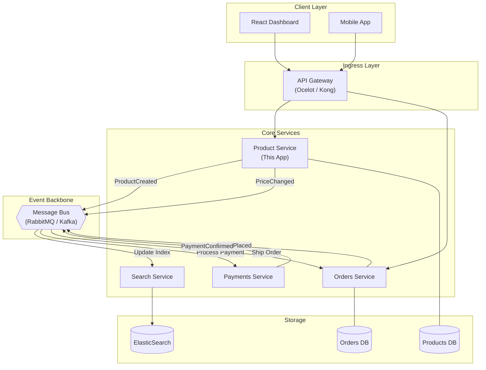

# Distributed Microservices Architecture

This document outlines how the **Products Service** fits within a modern, event-driven microservices ecosystem.

## High-Level System Design

## Key Architectural Patterns

### 1. Event-Driven Communication
Instead of tight coupling via synchronous REST calls, services communicate asynchronously through a **Message Bus**. 
- When a product is created in our service, it publishes a `ProductCreated` event.
- The **Search Service** consumes this to update the ElasticSearch index instantly.
- The **Inventory Service** (optional) consumes it to initialize stock levels.

### 2. Database per Service
Each service owns its own data store (as shown with `PDB` and `ODB`). This ensures:
- **Scalability**: Databases can be tuned for specific workloads.
- **Independence**: Failures in the Orders DB don't take down the Products Service.

### 3. API Gateway Pattern
The **React Frontend** doesn't talk to individual services. It hits a single gateway which handles:
- **Authentication/Authorization** (JWT validation)
- **Rate Limiting**
- **Load Balancing**
- **SSL Termination**

### 4. Eventual Consistency
Data across services (e.g., product details in the Orders service) is kept consistent over time through events. While the Orders service might have a slight delay before seeing a new product, this allows for a highly available and responsive system.
