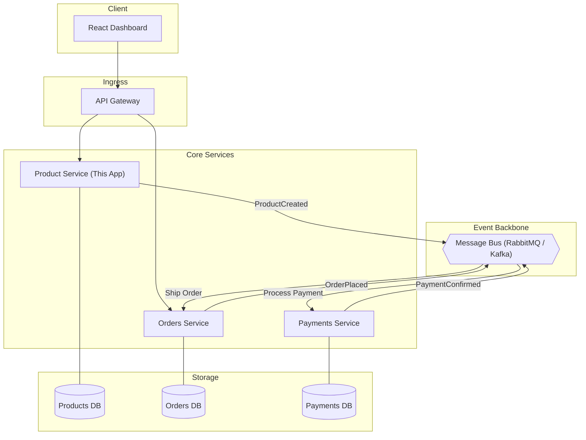

# Products Inventory System

A modern, full-stack products management system built with **.NET 9** and **React**. This project demonstrates a secure Web API, a premium frontend experience, and a distributed event-driven architecture design.

## Video Demo
[Watch the Demo Video](demo.mp4)

## Architecture & System Design
A detailed breakdown of the microservices event-driven architecture is available in the [ARCHITECTURE.md](./ARCHITECTURE.md) file.

## Repository
GitHub: [Hami0095/net-products-listing](https://github.com/Hami0095/net-products-listing)

## Quick Start

### 1. Prerequisites
- [.NET 9 SDK](https://dotnet.microsoft.com/download/dotnet/9.0)
- [Node.js & npm](https://nodejs.org/)

### 2. Backend Setup
```powershell
cd backend/src/Products.Api
dotnet run
```
*The API will be available at http://localhost:5000*

### 3. Frontend Setup
```powershell
cd frontend
npm install
npm run dev
```
*The Dashboard will be available at http://localhost:5173*

---

## Architecture

The system is designed to fit into a **Microservices Event-Driven Architecture**.



### Key Technical Features
- **JWT Authentication**: Secured endpoints for product creation and listing.
- **Health Checks**: Built-in monitoring at `/health`.
- **Advanced Filtering**: Retrieve products by specific attributes (e.g., Colour).
- **Unit & Integration Tests**: Comprehensive coverage using xUnit and FluentAssertions.
- **Premium UI**: Dark mode dashboard with glassmorphism and responsive design.

---

## Testing

Run the full test suite from the root:
```powershell
dotnet test backend/ProductsApp.sln
```

## Tech Stack
- **Backend**: C#, .NET 9, ASP.NET Core Web API, JWT Bearer Auth.
- **Frontend**: React, Vite, TypeScript, Vanilla CSS.
- **Testing**: xUnit, Moq, FluentAssertions, Microsoft.AspNetCore.Mvc.Testing.
- **Documentation**: Mermaid.js, Swagger.
